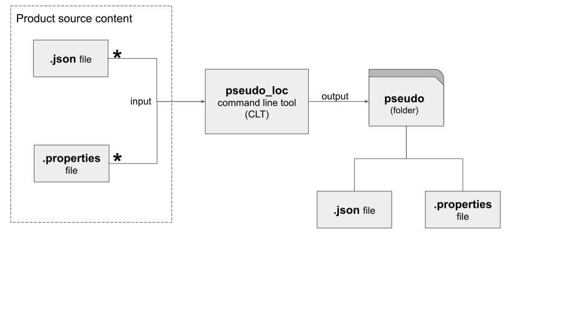

# pseudo_loc 

You can use this command line tool to pseudo-localize your application's 
user-facing messages to find concatenated messages as well as test 
the visual layouts for localization friendliness. 

## Overview



## Command Line Usage

% `pseudo-loc\bin\pseudo_loc -h`

``` 
usage: pseudo_loc [-h] [-o OUTPUT_FOLDER] [-e EXCLUSION_LIST] [-v] files [files ...]

Pseudo-localize a list of files

positional arguments:
  files                 list of files to be pseudo-localized

optional arguments:
  -h, --help            show this help message and exit
  -o OUTPUT_FOLDER, --output_folder OUTPUT_FOLDER
                        folder where the pseudo-localized files will be written to.
  -e EXCLUSION_LIST, --exclusion_list EXCLUSION_LIST
                        name of file containing identifiers of messages that WILL NOT be pseudo-localized
  -v, --version         show program's version number and exit

Thanks for using pseudo_loc!

```